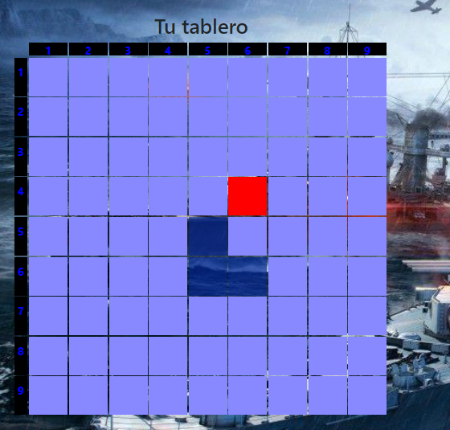
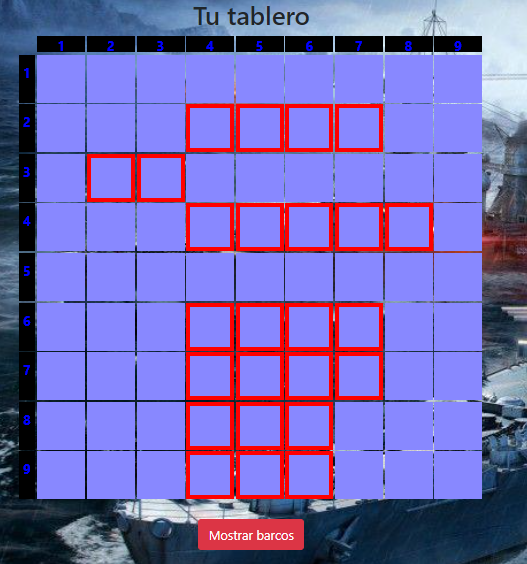
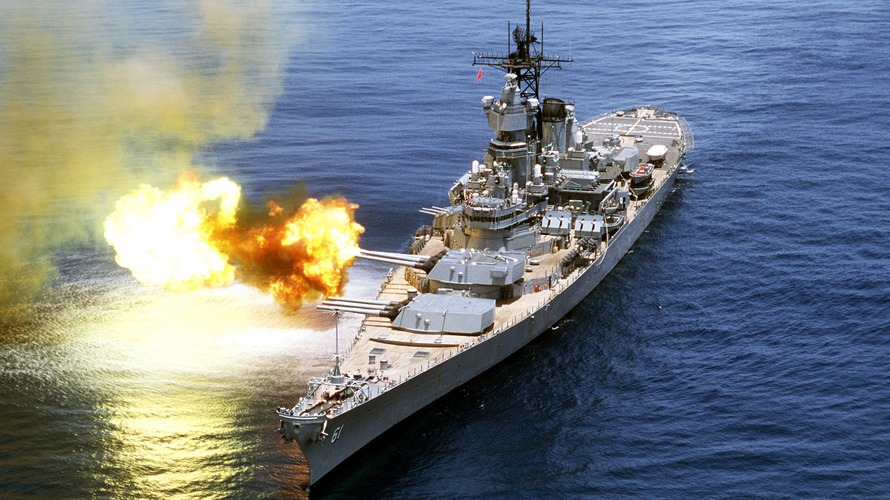

# Battleship with React.js!

- Esta app fue creada usando las siguientes tecnologías: HTML5, CSS3, Bootstrap, JavaScript y React.

- El template usado es similar a create-react-app (CRA), pero corresponde al boilerplate de 4Geeks Academy: react-hello.

##  Como inicializar la app

Clonar el repositorio:

    $ git clone git@github.com:Zagarsix/Battleship-with-React.js.git

Instalar el paquete npm:

    $ npm install

Inicializar el servidor local:

    $ npm run start

La App estará disponible en [localhost](http://localhost:3000/)

### Instrucciones del juego

- Debes elegir la posición de tus barcos, de forma horizontal o vertical. 
- El subtítulo indica el barco que debes ubicar y los espacios que ocupa.

- Una vez que hayas posicionado tus barcos, la CPU distribuye sus barcos automáticamente. 
- Tú eres el primero en "disparar". Si aciertas, el cuadrado quedará marcado en rojo. De lo contrario, quedará marcado en azul semitransparente, simulando el agua.

- Siempre que lo desees, puedes verificar la posición de tus barcos, presionando el botón "mostrar barcos" que se encuentra en la parte inferior de tu tablero.

- Finalmente, quien logre hundir todos los barcos del contrincante, se coronará como ganador de Battleship!!! Suerte!!!